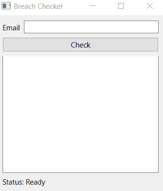

# Breach checker GUI
Application to check data breaches, built using PySide6. Data scrapped from [HIBP](https://haveibeenpwned.com/) website.

## How to run the app
- Install poetry
- Install dependency using `poetry install`
- Run application by `poetry run python main.py`